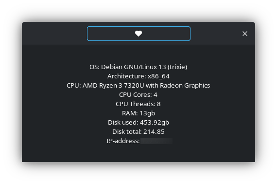

# Lapiz

### DEB-PACKAGES ISN'T SUPPORTED ANYMORE!

> [!IMPORTANT]
> The development of this project is FOR NOW frozen, I will unfreeze it soon.

Lapiz - simple system information tool on GTK3 👣!

## Features

- 📖 Shows info about your OS, disks, RAM, CPU and others.

- 🐧 Works on any distro.

## Installation

You can download Lapiz from [releases](https://github.com/progwi0/lapiz/releases) or via [Pix](https://github.com/progwi0/pix).
